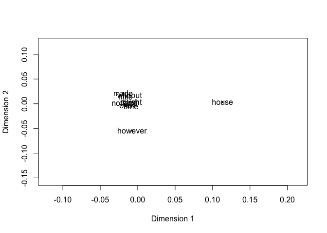
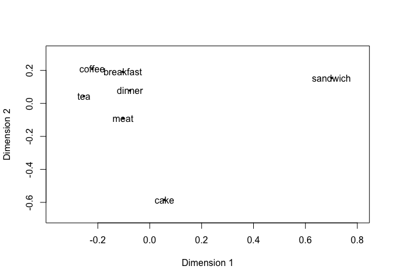

While dictionary-based approaches allow researchers to extract meaning from text
by identifying *a priori* certain groups of terms related to certain topics, the
structure and reliable patterns of use within language can themselves be used to
extract meaning. As John Firth put it, "You shall know a word by the company it
keeps" (1957). Firth couldn't have known about advances in language sciences at
the time, but this idea---that the meaning of words can be extracted simply by
looking at the contexts and co-occurrence patterns in which words are used,
without any human coding---is foundational to *vector-space approaches* in
language analysis.

This tutorial will demonstrate the use of vector-space approaches with latent
semantic analysis (LSA; Landauer et al., 1998) and word2vec (Mikolov et al.,
2013). As our corpus, we will use again example text from the `janeaustenr`
library, as we did in the dictionary-based and bag-of-words approach tutorial.
(As a reminder, this package includes 6 books from Jane Austen, with one line of
the printed text per line in the dataframe.)

***

# Preliminaries

First, let's get ready for our analyses. We do this by clearing our workspace
and loading in the libraries we'll need. It's good to get in the habit of
clearing your workspace from the start so that you don't accidentally have
clashes with unneeded variables or dataframes that could affect your results.

As with our other tutorials, we'll use a function here to check for all required
packages and---if necessary---install them before loading them. Implementing
this (or a similar) function is a helpful first step, especially if you plan on
sharing your code with other people.


```r
# clear the workspace (useful if we're not knitting)
rm(list=ls())
```


```r
# specify which packages we'll need
required_packages = c("tidyverse",
                      "stringr",
                      "tidytext",
                      "janeaustenr",
                      "lsa",
                      "LSAfun",
                      "tm",
                      "word2vec",
                      "text2vec")

# install them (if necessary) and load them
load_or_install_packages(required_packages)
```

***

# Data processing

***

## Inspecting the data

Our data are already fairly nicely processed for us, thanks to the work done in
creating the `janeaustenr` package. However, let's begin---as we always
should!---by having a look at our data.

We'll start by saving the output of the built-in function `austen_books()` to
something new and then inspecting the output. Note how we're using informative
variable names. Do a favor for others (and Future You!) and *always* use
informative variable names, along with plenty of comments. I find that it's
sometimes harder to retrace my steps through poorly commented code than it is to
just rewrite the whole thing from scratch.


```r
# let's see what we've got
book_df = austen_books()
head(book_df)
```

```
## # A tibble: 6 × 2
##   text                    book               
##   <chr>                   <fct>              
## 1 "SENSE AND SENSIBILITY" Sense & Sensibility
## 2 ""                      Sense & Sensibility
## 3 "by Jane Austen"        Sense & Sensibility
## 4 ""                      Sense & Sensibility
## 5 "(1811)"                Sense & Sensibility
## 6 ""                      Sense & Sensibility
```

***

## Labeling units of the text

For vector-space approaches, we need to select or create a unit of analysis,
typically known as the *document*. We can do this at a full level of a document
(like an entire book or an entire social media post), or we can subset a large
document into smaller portions (like a chapter or a page). In the case of the
current dataset, as we've mentioned before, we choose to look at a chapter or
page level. We'll use chapters here.


```r
# create a new variable called `chapter`
book_df = austen_books() %>%
  
  # give each book their own starting point
  group_by(book) %>%
  
  # convert chapter numbers to a numeric variable
  mutate(chapter = cumsum(str_detect(text, regex("^chapter [\\divxlc]",
                                                 ignore_case = TRUE)))) %>%
  ungroup() %>%
  
  # convert line-by-line to chapter-by-chapter rows
  group_by(book, chapter) %>%
  summarize(chapter_text = paste(text, collapse = " ")) %>% 
  ungroup()
```

```
## `summarise()` has grouped output by 'book'. You can override using the `.groups` argument.
```

```r
# show us what we've got
head(book_df)
```

```
## # A tibble: 6 × 3
##   book                chapter chapter_text                                      
##   <fct>                 <int> <chr>                                             
## 1 Sense & Sensibility       0 "SENSE AND SENSIBILITY  by Jane Austen  (1811)   …
## 2 Sense & Sensibility       1 "CHAPTER 1   The family of Dashwood had long been…
## 3 Sense & Sensibility       2 "CHAPTER 2   Mrs. John Dashwood now installed her…
## 4 Sense & Sensibility       3 "CHAPTER 3   Mrs. Dashwood remained at Norland se…
## 5 Sense & Sensibility       4 "CHAPTER 4   \"What a pity it is, Elinor,\" said …
## 6 Sense & Sensibility       5 "CHAPTER 5   No sooner was her answer dispatched,…
```

***

# Latent semantic analysis

***

## Prepare text

For LSA, each distinct orthographic representation will be treated as an
entirely separate entity. For example, `THIS`, `this`, `This` would all be
treated as unique items. Typically, this is handled by first converting all text
to lowercase. There are multiple ways we can do this, but `tidytext`'s
`unnest_lines()` functions takes care of many of these things at once.


```r
# clean up each row
tidy_book_df = book_df %>% 
  tidytext::unnest_lines(chapter_text, chapter_text)

# take a peek at what we have
head(tidy_book_df)
```

```
## # A tibble: 6 × 3
##   book                chapter chapter_text                                      
##   <fct>                 <int> <chr>                                             
## 1 Sense & Sensibility       0 "sense and sensibility  by jane austen  (1811)   …
## 2 Sense & Sensibility       1 "chapter 1   the family of dashwood had long been…
## 3 Sense & Sensibility       2 "chapter 2   mrs. john dashwood now installed her…
## 4 Sense & Sensibility       3 "chapter 3   mrs. dashwood remained at norland se…
## 5 Sense & Sensibility       4 "chapter 4   \"what a pity it is, elinor,\" said …
## 6 Sense & Sensibility       5 "chapter 5   no sooner was her answer dispatched,…
```

There are, of course, other things that you might want to consider. For example,
do you care about punctuation? (That is, do you want `this?` and `this` and
`this.` to be considered as separate items? Typically, you don't, and you would
strip punctuation from them.) And what about stopwords? (That is, do you want
those very high-frequency words in your corpus?) And on the other hand, what
about very *low*-frequency words? (A common way of dealing with this is to
remove any words that appear in fewer than 5 unique documents in the entire
corpus.) 

There are many ways to do these, but we'll use built-in functions from `tm` to
quickly strip out stopwords and punctuation in the next section.

***

## Convert our dataset to a corpus

We've done a lot of data processing, but we'll need to convert our text to
a `Corpus` object so that the function can use it. From there, we can easily
remove stopwords and punctuation. We'll also remove the word `chapter` from
consideration, since it appears at the beginning of each row. (There are
better ways to do it, but we'll go ahead and do it this way for simplicity.
For those of you interested, I would recommend doing a regular expression
that looks for the word `Chapter` at the beginning of each document.)


```r
# convert our chapter-by-chapter dataframe to a Corpus object
austen_corpus = tm::Corpus(VectorSource(tidy_book_df$chapter_text))

# remove stopwords
austen_corpus = tm_map(austen_corpus,
                           function(x){
                             removeWords(x, c(stopwords("english"),
                                              "chapter"))})
```

```
## Warning in tm_map.SimpleCorpus(austen_corpus, function(x) {: transformation
## drops documents
```

```r
# remove punctuation
austen_corpus = tm_map(austen_corpus, removePunctuation)
```

```
## Warning in tm_map.SimpleCorpus(austen_corpus, removePunctuation): transformation
## drops documents
```

***

## Creating term-document matrix

Next, we need to create our term-document matrix. The `tm` package
can do this pretty easily and quickly right from a dataframe!

We'll also weight the space to account for the sparsity of the matrix: Some
words are very frequent, and others are very rare. Weighting the matrix helps
account for those differences.


```r
# convert the Corpus object into a term-document matrix
austen_tdm = as.matrix(tm::TermDocumentMatrix(austen_corpus))

# weight the space
austen_tdm = lw_logtf(austen_tdm) * gw_idf(austen_tdm)
```

*** 

## Running latent semantic analysis

And here we go!


```r
# one line of code!
austen_lsa = lsa::lsa(austen_tdm)

# okay, well---one more to convert it
austen_lsa = as.textmatrix(austen_lsa)

# let's look at it
austen_lsa[1:5,1:20]
```

```
##                        1             2            3            4            5
## 1811        0.0002301586  0.0008914904 -0.001105032  0.001140858  0.001044208
## austen      0.0006941235  0.0065889365  0.003279336  0.002988952  0.001335460
## jane        0.1564430689 -0.5194571674  0.034444367 -0.437415577 -0.219634436
## sense       0.0310901785  1.2541430021  0.440702924  1.274041222  1.282493450
## sensibility 0.0337415010  0.8830449007  0.130198066  1.018808334  1.039641949
##                        6             7             8             9           10
## 1811        6.844227e-05 -0.0004801906 -0.0002921553  6.441809e-05  0.002101975
## austen      3.725232e-03 -0.0037026159 -0.0027997744 -4.103871e-04 -0.005409547
## jane        9.068761e-02 -0.6131180237 -0.4591318363 -3.609536e-01 -0.321080957
## sense       5.344498e-01  0.3218797746  0.6089331036  6.033226e-01  1.038982300
## sensibility 1.747435e-01  0.4036106132  0.4433659024  4.413165e-01  1.179047933
##                       11            12            13           14            15
## 1811         0.003830602  0.0003746796  0.0005797171 -0.001013871  0.0001677491
## austen       0.005295581 -0.0017353642 -0.0023617243 -0.006161166 -0.0017738041
## jane        -0.324891893 -0.3808500227  0.2188229685  0.025685212 -0.0431470723
## sense        1.879932004  0.9169316585  0.6960940985  0.135983305  0.7473022843
## sensibility  2.077642152  0.7228656716  0.5725041936  0.212307179  0.3977458886
##                        16            17            18            19
## 1811         0.0004634124  0.0007970868  0.0010341623  0.0005797838
## austen      -0.0060050463 -0.0036431172  0.0003118131 -0.0034668590
## jane         0.1487685569 -0.7125598395 -0.1253940836 -0.6594099061
## sense        1.3457608220  1.2400607991  1.0873183540  0.5598437346
## sensibility  0.7289959629  0.8140998179  0.8018226650  0.7576378412
##                       20
## 1811        -0.000637187
## austen      -0.003029738
## jane         0.271405828
## sense        1.068556156
## sensibility  0.189344278
```

And there you have it! Now we have our vector-space representation of the
semantics of Jane Austen (well, six of her books, anyway). You can see a snippet
of how the program "understands" each word in the printed text above: It's a
series of weights (only on the first 20 dimensions) of the first 5 words of the
book.

Now, let's do some exploring!

***

## Visualize the similarities

You might be interested in seeing what words are seen as most similar in the
multidimensional space. You can visualize this by using the `plot_neighbors()`
function.


```r
# plot some of the nearest neighbors in multidimensional space, projected down
plot_neighbors("house", # choose a single word
               n = 10, # say how many neighbors you want to see
               tvectors = austen_lsa, # give the name of the matrix space
               method = "MDS", # say how you want the dimensions reduced
               dims = 2) # specify whether you want a 2D or 3D projection
```

<!-- -->

```
##                    x            y
## house    0.113362640  0.003351132
## might   -0.007168601  0.002643542
## time    -0.008821119 -0.004670383
## much    -0.010438164  0.004180653
## without -0.010750445  0.017557678
## one     -0.015711510 -0.004760431
## little  -0.015827630  0.014580309
## nothing -0.017756457 -0.000128451
## however -0.007428825 -0.054312924
## made    -0.019459889  0.021558876
```

***

## Quantifying similarities

It's good to get to know your data by exploring similarities, but if you're
doing this for a project, you probably have a specific list of words that you
might want to understand. Let's start by specifying some of those words here.

Perhaps we're interested in exploring food in Jane Austen's works.


```r
# create a list of words
distance_list = c("breakfast", "dinner", "tea", "coffee", "cake", "meat", "sandwich")
```


```r
# let's try visualizing our chosen words with a variant of the `plot_neighbors()` function
plot_wordlist(distance_list, # put your list in here
               tvectors = austen_lsa,
               method = "MDS",
               dims = 2)
```

<!-- -->

```
##                     x           y
## breakfast -0.10373104  0.19120986
## dinner    -0.07604644  0.07827431
## tea       -0.25328186  0.04425812
## coffee    -0.22180360  0.20867551
## cake       0.05707278 -0.58455243
## meat      -0.10263212 -0.09105633
## sandwich   0.70042228  0.15319097
```

While visualizing can be quite helpful, we probably want some numbers to try to
analyze quantitatively. We can do that by getting the cosine similarity between
words: Higher cosine similarities mean that the words are closer together in
multidimensional space, while lower cosine similarities mean that they are
further away in multidimensional space.


```r
# get a matrix of cosine distances!
multicos(distance_list, tvectors = austen_lsa)
```

```
##            breakfast    dinner          tea      coffee         cake
## breakfast 1.00000000 0.4651919 0.3219849950  0.17057333  0.087513690
## dinner    0.46519194 1.0000000 0.4975877353  0.35750819  0.240852385
## tea       0.32198500 0.4975877 1.0000000000  0.38752958  0.197456999
## coffee    0.17057333 0.3575082 0.3875295769  1.00000000  0.068571551
## cake      0.08751369 0.2408524 0.1974569994  0.06857155  1.000000000
## meat      0.12986394 0.2792781 0.2440645691  0.11447507  0.077469531
## sandwich  0.02974685 0.1476370 0.0002332918 -0.01170900 -0.005057775
##                  meat      sandwich
## breakfast  0.12986394  0.0297468542
## dinner     0.27927814  0.1476370289
## tea        0.24406457  0.0002332918
## coffee     0.11447507 -0.0117090030
## cake       0.07746953 -0.0050577755
## meat       1.00000000 -0.0174969475
## sandwich  -0.01749695  1.0000000000
```

From here, we can use the cosine values in statistical analyses---for example,
if you wanted to see whether you could recover the kind of food served at
different meals based on their cosine similarities.

***

# word2vec

***

## Prepare vectors

For simplicity, we will not discuss how to train a `word2vec` model, but it can
be done in the `word2vec` library. Instead, we will use the pretrained vectors
created from the Google News corpus, which you should have downloaded as part
of the preparation for this section.


```r
# read in the pretrained vectors
model_path = read.word2vec("/Users/alex/Downloads/GoogleNews-vectors-negative300.bin")
google_news_embeddings = as.matrix(model_path)
```

***

## Explore word-to-word similarity

Like with LSA, we can compare specific words with one another. Let's see how
similar the food words from the LSA exercise are in the Google News corpus!


```r
# specify which words we want to explore
food_words = google_news_embeddings[c("breakfast", "dinner", 
                                      "tea", "coffee", 
                                      "cake", "meat", "sandwich"), ]
```


```r
# let's create another similarity matrix!
word2vec_similarity(food_words, food_words,
                    type='cosine')
```

```
##           breakfast    dinner       tea    coffee      cake      meat  sandwich
## breakfast 1.0000000 0.7007028 0.3408980 0.4786409 0.3508953 0.2729341 0.4799844
## dinner    0.7007028 1.0000000 0.2793936 0.3216742 0.3872904 0.2930589 0.3599442
## tea       0.3408980 0.2793936 1.0000000 0.5635292 0.3050650 0.2017717 0.1907384
## coffee    0.4786409 0.3216742 0.5635292 1.0000000 0.2968854 0.2835641 0.4231377
## cake      0.3508953 0.3872904 0.3050650 0.2968854 1.0000000 0.2960444 0.4244461
## meat      0.2729341 0.2930589 0.2017717 0.2835641 0.2960444 1.0000000 0.4273114
## sandwich  0.4799844 0.3599442 0.1907384 0.4231377 0.4244461 0.4273114 1.0000000
```

***

## Quantifying document-level similarities

Next, we might want to compare similarities of phrases or documents, rather than
specific words. To do that, we can use `doc2vec()`. Again, we could use whatever
segment we wanted. Here, we'll use the 275 chapters from the 6 Jane Austen
books, like we did with our LSA analysis.

First, we'll need to do a bit of formatting so that we give `doc2vec()` what it
expects to see.


```r
# convert book dataframe to the appropriate format
reformatted_tidy_books = tidy_book_df %>%
  
  # remove unneeded variables
  dplyr::select(-chapter, -book) %>%
  
  # give a document id column
  rownames_to_column(var = "doc_id") %>%
  
  # rename text variable
  rename(c("text" = "chapter_text"))

# let's take a peek
head(reformatted_tidy_books)
```

```
## # A tibble: 6 × 2
##   doc_id text                                                                   
##   <chr>  <chr>                                                                  
## 1 1      "sense and sensibility  by jane austen  (1811)    "                    
## 2 2      "chapter 1   the family of dashwood had long been settled in sussex.  …
## 3 3      "chapter 2   mrs. john dashwood now installed herself mistress of norl…
## 4 4      "chapter 3   mrs. dashwood remained at norland several months; not fro…
## 5 5      "chapter 4   \"what a pity it is, elinor,\" said marianne, \"that edwa…
## 6 6      "chapter 5   no sooner was her answer dispatched, than mrs. dashwood i…
```

Next, we'll get the embeddings for each chapter using the vector space specified
at our model path.


```r
# get embeddings for each chapter
chapter_embeddings = doc2vec(model_path, # give the path to the model here
                             reformatted_tidy_books, # say the dataframe we want here
                             type = "embedding")
```

Alrighty, now we can create a chapter-to-chapter matrix of cosine similarities!


```r
# calculate chapter-to-chapter similarities
chapter_similarities = word2vec_similarity(chapter_embeddings,chapter_embeddings,
                                           type='cosine')
```

We could, then, use these similarities to see which chapters are most similar in
their vector spaces. For example, are the chapters within a book all more
similar than across books? Or could you see a dramatic arc in the narrative,
perhaps with the beginning and ending of each book being more similar than the
ending of the book? Or if you were a Jane Austen scholar, you might have other
guesses about what books and/or chapters might be most similar---and you could
test those guesses with this!
